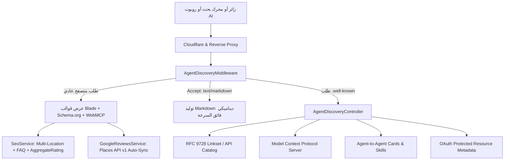

# 🚀 الدليل الشامل لتهيئة المواقع لمحركات البحث (SEO) والذكاء الاصطناعي (AI Agent-Ready Blueprint)
> **دليل هندسي قابل لإعادة الاستخدام في أي مشروع ويب جديد (Laravel / PHP / Modern Web)**  
> تم بناء هذا المرجع استناداً إلى أحدث المعايير القياسية لعام 2026: **Google Local SEO, Schema.org Multi-Location, W3C Web Standards, RFC 9728, RFC 8414, Model Context Protocol (MCP), و Level 5 AI Agent Readiness (IsItAgentReady.com)**.

---

## 📑 فهرس المحتويات
1. [المعمارية العامة للحل (Architecture Overview)](#1-المعمارية-العامة-للحول)
2. [القسم الأول: التهيئة البرمجية لمحركات البحث (Advanced On-Page & Technical SEO)](#2-القسم-الأول-التهيئة-البرمجية-لمحركات-البحث)
3. [القسم الثاني: البيانات المنظمة (Schema.org & Rich Snippets)](#3-القسم-الثاني-البيانات-المنظمة)
4. [القسم الثالث: جاهزية وكلاء الذكاء الاصطناعي (Level 5 Agent-Ready Architecture)](#4-القسم-الثالث-جاهزية-وكلاء-الذكاء-الاصطناعي)
5. [القسم الرابع: الربط التلقائي بمراجعات جوجل (Google Places API v1 Auto-Sync)](#5-القسم-الرابع-الربط-التلقائي-بمراجعات-جوجل)
6. [القسم الخامس: إعدادات السيرفر و Cloudflare](#6-القسم-الخامس-إعدادات-السيرفر-و-cloudflare)
7. [القسم السادس: قائمة التحقق السريعة لأي مشروع جديد (New Project Checklist)](#7-القسم-السادس-قائمة-التحقق-السريعة)

---

## 1. المعمارية العامة للحل (Architecture Overview)

الهدف من هذا النظام هو تحويل أي موقع إلكتروني من مجرد "صفحات HTML عادية" إلى:
1. **كيان جغرافي ورقمي متصدر في جوجل (Google Ranking Machine)** يستهدف نطاقات متعددة (مثل: مقر في مصر + تغطية تجارية في السعودية).
2. **واجهة تفاعلية مهيأة لوكلاء الذكاء الاصطناعي (AI Agent-Native Web)** تقرأها روبوتات ChatGPT, Claude, Perplexity, و AI Agents وتستطيع فهم خدمات الموقع والتعامل مع أدواته برمجياً (WebMCP & A2A).



---

## 2. القسم الأول: التهيئة البرمجية لمحركات البحث

### 2.1 الوسوم الميتا الأساسية والإقليمية (Meta Tags & Geo-Targeting)
يجب أن تحتوي كل صفحة على الوسوم الميتا التالية داخل `<head>`:

```html
<!-- الوسوم القياسية -->
<title>إشراق تك | شركة برمجة وتصميم مواقع وتطبيقات | دمياط الجديدة والسعودية</title>
<meta name="description" content="شركة إشراق تك: أفضل شركة برمجة وتصميم مواقع وتطبيقات في دمياط الجديدة والمملكة العربية السعودية...">
<meta name="keywords" content="شركة برمجة في دمياط الجديدة, تصميم مواقع دمياط, برمجة تطبيقات السعودية...">
<link rel="canonical" href="https://ishraq.tech/">

<!-- استهداف المناطق الجغرافية المزدوجة (GEO Meta Tags) -->
<meta name="geo.region" content="EG-DT, SA-01">
<meta name="geo.placename" content="New Damietta, Damietta, Riyadh, Egypt, Saudi Arabia">
<meta name="geo.position" content="31.4397;31.6644">
<meta name="ICBM" content="31.4397, 31.6644">
<meta name="country" content="EG, SA">
<meta name="coverage" content="Egypt, New Damietta, Saudi Arabia, Riyadh, Jeddah, GCC">

<!-- اللغات والاستهداف الإقليمي (Hreflang) -->
<link rel="alternate" hreflang="ar-EG" href="https://ishraq.tech/">
<link rel="alternate" hreflang="ar-SA" href="https://ishraq.tech/">
<link rel="alternate" hreflang="ar" href="https://ishraq.tech/">
<link rel="alternate" hreflang="x-default" href="https://ishraq.tech/">

<!-- OpenGraph & Twitter Cards -->
<meta property="og:type" content="website">
<meta property="og:locale" content="ar_AR">
<meta property="og:title" content="...">
<meta property="og:description" content="...">
<meta property="og:image" content="https://ishraq.tech/images/og-image.jpg">
<meta name="twitter:card" content="summary_large_image">
```

### 2.2 خرائط الموقع الديناميكية (XML Sitemaps)
تم تقسيم الـ Sitemap إلى فهرس رئيسي يجمع خرائط فرعية متخصصة مع الحفظ المؤقت (Cache) والتحديث التلقائي:
* `https://ishraq.tech/sitemap.xml` (الفهرس الرئيسي - Sitemap Index)
  * `sitemap-pages.xml` (الصفحات الثابتة)
  * `sitemap-projects.xml` (المشاريع ومعرض الأعمال)
  * `sitemap-articles.xml` (المقالات والمدونة)

### 2.3 ملف التحكم في الروبوتات (Robots.txt)
يتيح لمحركات البحث وروبوتات الذكاء الاصطناعي الأرشفة الكاملة، مع منع لوحة التحكم فقط:
```txt
User-agent: *
Allow: /
Disallow: /admin
Disallow: /filament

# السماح الصريح لروبوتات الذكاء الاصطناعي
User-agent: GPTBot
Allow: /
User-agent: ClaudeBot
Allow: /
User-agent: PerplexityBot
Allow: /
User-agent: Google-Extended
Allow: /

Sitemap: https://ishraq.tech/sitemap.xml
```

---

## 3. القسم الثاني: البيانات المنظمة (Schema.org & Rich Snippets)

يتم توليد البيانات المنظمة مركزياً عبر خدمة [SeoService.php](file:///mnt/essam/sites/ishraq/app/Services/SeoService.php) بصيغة `application/ld+json`.

### 3.1 الهوية التجارية متعددة المقرات (Dual-Branch LocalBusiness Schema)
تخبر جوجل بأن الشركة تمتلك مقراً فيزيائياً في دمياط الجديدة، وفرعاً/تغطية تجارية رسمية في السعودية:

```json
{
  "@context": "https://schema.org",
  "@graph": [
    {
      "@type": ["Organization", "Corporation"],
      "@id": "https://ishraq.tech/#organization",
      "name": "إشراق لتصميم وتطوير البرمجيات",
      "url": "https://ishraq.tech",
      "logo": "https://ishraq.tech/storage/logos/logo.png",
      "telephone": "+201554468657",
      "email": "contact@ishraq.tech",
      "department": [
        {
          "@type": ["LocalBusiness", "ProfessionalService"],
          "@id": "https://ishraq.tech/#branch-damietta",
          "name": "إشراق تك - مقر دمياط الجديدة (مصر)",
          "telephone": "+201554468657",
          "address": {
            "@type": "PostalAddress",
            "streetAddress": "المنطقة المركزية - دمياط الجديدة",
            "addressLocality": "دمياط الجديدة",
            "addressRegion": "دمياط",
            "postalCode": "34517",
            "addressCountry": "EG"
          },
          "geo": {
            "@type": "GeoCoordinates",
            "latitude": "31.4397",
            "longitude": "31.6644"
          },
          "areaServed": ["دمياط الجديدة", "دمياط", "المنصورة", "مصر"],
          "openingHours": "Mo,Tu,We,Th,Su 09:00-18:00"
        },
        {
          "@type": ["LocalBusiness", "ProfessionalService"],
          "@id": "https://ishraq.tech/#branch-saudi",
          "name": "إشراق تك - خدمات وحلول السعودية والخليج",
          "telephone": "+201554468657",
          "address": {
            "@type": "PostalAddress",
            "addressLocality": "الرياض",
            "addressRegion": "منطقة الرياض",
            "addressCountry": "SA"
          },
          "geo": {
            "@type": "GeoCoordinates",
            "latitude": "24.7136",
            "longitude": "46.6753"
          },
          "areaServed": ["المملكة العربية السعودية", "الرياض", "جدة", "الدمام"]
        }
      ]
    }
  ]
}
```

### 3.2 الأسئلة الشائعة للظهور في نتائج جوجل (FAQ Schema)
تُمكّن الموقع من الحصول على مساحة مضاعفة في نتائج البحث الأولى بفضل الأسئلة المنسدلة:
```json
{
  "@context": "https://schema.org",
  "@type": "FAQPage",
  "mainEntity": [
    {
      "@type": "Question",
      "name": "هل تقدم شركة إشراق خدمات برمجة المواقع والتطبيقات في دمياط الجديدة؟",
      "acceptedAnswer": {
        "@type": "Answer",
        "text": "نعم، شركة إشراق تقدم خدمات تطوير البرمجيات المتكاملة..."
      }
    }
  ]
}
```

### 3.3 تقييمات النجوم الذهبية (AggregateRating Schema)
تُظهر النجوم الصفراء `★★★★★ 5.0` أسفل رابط الموقع في نتائج جوجل:
```json
{
  "@context": "https://schema.org",
  "@type": "Product",
  "name": "خدمات تطوير وتصميم البرمجيات",
  "aggregateRating": {
    "@type": "AggregateRating",
    "ratingValue": "5.0",
    "bestRating": "5",
    "worstRating": "1",
    "ratingCount": "15",
    "reviewCount": "15"
  }
}
```

---

## 4. القسم الثالث: جاهزية وكلاء الذكاء الاصطناعي (Level 5 Agent-Ready Architecture)

لتحقيق درجة **المستوى الخامس (Level 5 - Highest Level)** على فاحص الوكلاء العالمي `isitagentready.com`:

### 4.1 تفاوض المحتوى (Content Negotiation - Markdown First)
تم إنشاء Middleware باسم `AgentDiscoveryMiddleware`:
- إذا أرسل الروبوت (مثل Claude أو GPT أو AutoGPT) ترويسة `Accept: text/markdown`:
- يتم تخطي الـ HTML والـ CSS وتوليد تمثيل Markdown خفيف الوزن وسريع ومفهوم 100% للروبوتات يحتوي على اسم الصفحة، الوصف، الخدمات، الروابط، وأرقام التواصل.

### 4.2 مسارات الاستكشاف القياسية (.well-known Endpoints)
تمت برمجتها داخل [AgentDiscoveryController.php](file:///mnt/essam/sites/ishraq/app/Http/Controllers/AgentDiscoveryController.php):

| المسار | المعيار والمواصفة | الفائدة |
| :--- | :--- | :--- |
| `/.well-known/api-catalog` | **RFC 9728 (Linkset)** | دليل كامل بجميع واجهات برمجة التطبيقات للموقع بنوع `application/linkset+json`. |
| `/.well-known/oauth-protected-resource` | **RFC 9728** | يعرف الوكلاء بكيفية التوثيق والنطاقات المدعومة (Scopes). |
| `/.well-known/oauth-authorization-server` | **RFC 8414** | يتضمن كتلة `agent_auth` لأنواع هويات الوكلاء (ID-JAG / Email). |
| `/auth.md` | **Agent Auth Guide** | تعليمات تسجيل واستخدام الوكلاء بصيغة Markdown في جذر الموقع. |
| `/.well-known/mcp.json` | **Model Context Protocol** | كارت تعريف سيرفر الـ MCP للأدوات والموارد السحابية. |
| `/.well-known/agent-card.json` | **A2A Protocol** | كارت التواصل بين الوكلاء الذاتيين (Agent-to-Agent). |
| `/.well-known/agent-skills/index.json` | **Agent Skills Index** | فهرس المهارات البرمجية التي يمكن للوكيل استدعاؤها. |
| `/.well-known/agent-readiness.json` | **ARD Manifest** | بيان جاهزية الوكلاء الرسمي (Agent Readiness Document). |

### 4.3 ترويسات الاستكشاف (HTTP Link Headers)
يتم حقن الترويسة التالية في كل استجابة HTTP ليعثر الوكيل على المسارات فوراً:
```http
Link: </.well-known/api-catalog>; rel="api-catalog"; type="application/linkset+json",
      </.well-known/mcp.json>; rel="mcp-server",
      </.well-known/agent-card.json>; rel="agent-card",
      </.well-known/agent-readiness.json>; rel="agent-readiness"
```

### 4.4 تسجيل أدوات المتصفح (WebMCP Tools)
تم تضمين وسم سكريبت داخل الـ `<head>` في [app.blade.php](file:///mnt/essam/sites/ishraq/resources/views/components/layouts/app.blade.php):
```html
<script type="application/webmcp+json">
{
  "tools": [
    { "name": "contact_company", "description": "إرسال طلب استشارة أو تواصل" },
    { "name": "view_services", "description": "استعراض الخدمات البرمجية والأسعار" },
    { "name": "get_reviews", "description": "جلب تقييمات العملاء وآراء خرائط جوجل" }
  ]
}
</script>
```

---

## 5. القسم الرابع: الربط التلقائي بمراجعات جوجل (Google Places API v1 Auto-Sync)

### 5.1 آلية العمل
بدلاً من نسخ التقييمات يدوياً، يتم سحب أي تقييم يكتبه العميل على Google Maps تلقائياً:

1. **الخدمة البرمجية [GoogleReviewsService.php](file:///mnt/essam/sites/ishraq/app/Services/GoogleReviewsService.php):**
   - تتصل بـ `https://places.googleapis.com/v1/places/{Place_ID}` (الجيل الحديث من Places API).
   - تستخدم الترويسات:
     - `X-Goog-Api-Key: YOUR_KEY`
     - `X-Goog-FieldMask: displayName,rating,reviews,userRatingCount`
2. **تخزين وتحديث التقييمات:**
   - تحفظ الاسم، صورة العميل، نص التقييم، عدد النجوم، ورابط حسابه على خرائط جوجل مع شارة `مراجعة Google موثقة ✦`.
3. **التشغيل الآلي (Automation):**
   - **الخلفية المجدولة:** أمر `php artisan google:sync-reviews` يعمل مرتين يومياً عبر Cron Job.
   - **الزيارات اللحظية:** عند فتح صفحة الشهادات، يتم الفحص بمعدل مرة كل ساعتين (عبر Cache Lock) لتحديث التقييمات للزوار.

---

## 6. القسم الخامس: إعدادات السيرفر و Cloudflare

### 6.1 قاعدة Cloudflare لتعديل الترويسات (Response Header Rule)
يتطلب معيار **RFC 9728** أن يكون مسار الـ `api-catalog` بنوع محتوى محدد:
* **Match:** `(http.request.full_uri eq "/.well-known/api-catalog")`
* **Then Modify Response Header:**
  * `Content-Type` = `application/linkset+json`

### 6.2 سجلات الـ DNS لاكتشاف الوكلاء (DNS-AID)
تضاف سجلات TXT في الـ DNS كالتالي:
| النوع | الاسم (Host) | القيمة (Value) |
| :--- | :--- | :--- |
| `TXT` | `@` أو `ishraq.tech` | `agent-id=https://ishraq.tech/.well-known/agent-card.json` |
| `TXT` | `_agent-catalog` | `https://ishraq.tech/.well-known/api-catalog` |
| `TXT` | `_agent-skills` | `https://ishraq.tech/.well-known/agent-skills/index.json` |

---

## 7. القسم السادس: قائمة التحقق السريعة لأي مشروع جديد

عند بدء أي مشروع ويب جديد ترغب في تصدره محركات البحث وجاهزيته الكاملة للذكاء الاصطناعي:

### الخطوة 1: ملفات الـ SEO الأساسية
- [ ] انسخ كود `SeoService.php` وضعه في `app/Services/SeoService.php`.
- [ ] أنشئ مكون الميتا `x-seo-meta` وضعه في `resources/views/components/seo-meta.blade.php`.
- [ ] اضبط وسوم الـ GEO والـ Hreflang وفقاً للمدن المستهدفة.

### الخطوة 2: ملفات جاهزية وكلاء الذكاء الاصطناعي (Agent-Ready)
- [ ] انسخ `AgentDiscoveryController.php` وضعه في `app/Http/Controllers/`.
- [ ] انسخ `AgentDiscoveryMiddleware.php` وسجله في `bootstrap/app.php` ليعمل على الـ Web.
- [ ] أضف مسارات `.well-known` في `routes/web.php`.
- [ ] أنشئ ملف `public/auth.md` و `public/content-signals.json`.

### الخطوة 3: نشاط جوجل ومراجعات Google Places
- [ ] أنشئ وثبّت ملف Google Business Profile لنشاطك التجاري وحدد نطاقات الخدمة.
- [ ] استخرج رابط التقييم المباشر (`g.page/r/.../review`).
- [ ] فعّل Places API من Google Cloud Console وضع الـ `API Key` و `Place ID` في إعدادات الموقع.
- [ ] شغّل `php artisan google:sync-reviews` لربط المراجعات مباشرة.

### الخطوة 4: الفحص والاختبار النهائي
- [ ] افحص الموقع على: [Google Rich Results Test](https://search.google.com/test/rich-results) للتأكد من قراءة LocalBusiness و FAQ و AggregateRating.
- [ ] افحص الموقع على: [IsItAgentReady Scanner](https://isitagentready.com) وتأكد من الحصول على **Level 5** في كافة الفئات.
- [ ] أرسل خريطة الموقع `sitemap.xml` إلى Google Search Console.

---
**تم إعداد وتوثيق هذا الدليل بواسطة Antigravity AI Engineering.** 🚀
