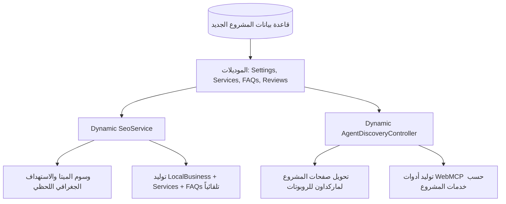

# 🚀 الدليل الهندسي الشامل والمُعمم (Dynamic SEO & AI Agent Blueprint)
> **نظام برمجي ديناميكي ذكي قابل لإعادة الاستخدام في أي مشروع ويب جديد (أي مجال: طبي، تجارة إلكترونية، عقارات، مقاولات، شركات تقنية، خدمات عامة...)**  
> يعتمد هذا النظام على **قاعدة بيانات المشروع وإعداداته الفعلية (Database-Driven)** لتوليد كافة وسوم الـ SEO، والبيانات المنظمة (Schema.org)، وجاهزية وكلاء الذكاء الاصطناعي (Agent-Ready Level 5) تلقائياً دون الحاجة لتعديل يدوي.

---

## 📑 فهرس الدليل
1. [المفهوم الأساسي: كيف يعمل النظام بديناميكية تامة؟](#1-المفهوم-الأساسي)
2. [هيكلية قاعدة البيانات المطلوبة لأي مشروع (Database Schema)](#2-هيكلية-قاعدة-البيانات)
3. [خدمة الـ SEO الديناميكية الشاملة (Dynamic SeoService.php)](#3-خدمة-الـ-seo-الديناميكية)
4. [توليد Schema.org حسب مجال أي مشروع (Multi-Industry Adapter)](#4-توليد-schema-حسب-مجال-المشروع)
5. [محرك الذكاء الاصطناعي التلقائي (Dynamic Agent Discovery & Markdown)](#5-محرك-الذكاء-الاصطناعي-التلقائي)
6. [الربط الذكي بمراجعات خرائط جوجل لأي نشاط (Universal Google Reviews)](#6-الربط-الذكي-بمراجعات-جوجل)
7. [خطوات التركيب في أي مشروع جديد خلال 5 دقائق](#7-خطوات-التركيب-السريعة)

---

## 1. المفهوم الأساسي: كيف يعمل النظام بديناميكية تامة؟

بدلاً من كتابة نصوص ثابتة (Hardcoded) لمشروع معين، يقوم النظام بقراءة:
1. **بيانات الكيان (Company / Business Settings):** اسم المشروع، الشعار، أرقام الهاتف، العناوين، الإحداثيات، نوع النشاط التجاري.
2. **الخدمات والمنتجات الفعّالة في المشروع (`Service::where('is_active', true)`):** لبناء كتالوج الخدمات للذكاء الاصطناعي ومحركات البحث تلقائياً.
3. **الأسئلة الشائعة الخاصة بالمشروع (`Faq::all()`):** لبناء أسئلة الـ Rich Snippets في نتائج بحث جوجل.
4. **فروع ومناطق الخدمة (`branches` أو المقرات المتعددة):** لاستهداف المدن والدول ديناميكياً في خرائط جوجل.



---

## 2. هيكلية قاعدة البيانات المطلوبة لأي مشروع (Database Schema)

لجعل أي مشروع جديد متوافقاً مع هذا النظام، تكفيك الهجرة (Migration) التالية لجدول إعدادات المشروع:

```php
Schema::create('company_settings', function (Blueprint $table) {
    $table->id();
    // هوية النشاط
    $table->string('company_name');                    // اسم المشروع أو النشاط
    $table->string('business_type')->default('LocalBusiness'); // نوع النشاط في Schema (انظر الجدول بالأسفل)
    $table->text('about_short')->nullable();           // نبذة تعريفية مختصرة
    $table->string('logo_path')->nullable();           // مسار الشعار
    $table->string('main_email')->nullable();          // البريد الإلكتروني
    
    // الاتصال والاستهداف الجغرافي (فرع رئيسي + فرع إضافي/إقليمي)
    $table->string('phone_primary')->nullable();       // الهاتف الأول
    $table->string('phone_secondary')->nullable();     // الهاتف الثاني
    $table->string('whatsapp_number')->nullable();     // واتساب
    
    // الفرع والموقع الأول
    $table->string('location_text')->nullable();       // العنوان الأول (مثال: القاهرة / دمياط / دبي)
    $table->string('city_primary')->nullable();        // المدينة الأولى
    $table->string('country_primary')->default('EG');  // كود الدولة الأولى (EG, SA, AE...)
    $table->decimal('latitude_primary', 10, 7)->nullable();  // خط العرض
    $table->decimal('longitude_primary', 10, 7)->nullable(); // خط الطول
    
    // الفرع والموقع الثاني (للتوسع الإقليمي كالسعودية أو الخليج)
    $table->string('location_secondary')->nullable();  // العنوان الثاني
    $table->string('city_secondary')->nullable();      // المدينة الثانية
    $table->string('country_secondary')->default('SA');
    $table->decimal('latitude_secondary', 10, 7)->nullable();
    $table->decimal('longitude_secondary', 10, 7)->nullable();

    // تقييمات جوجل
    $table->string('google_review_url')->nullable();   // رابط التقييم (g.page/r/.../review)
    $table->string('google_place_id')->nullable();     // Place ID
    $table->string('google_places_api_key')->nullable(); // مفتاح API السحب التلقائي
    
    $table->timestamps();
});
```

---

## 3. خدمة الـ SEO الديناميكية الشاملة (Dynamic SeoService.php)

انسخ هذا الكلاس وضعه في `app/Services/SeoService.php`. سيقوم بقراءة خدمات ومشاريع وبيانات أي موقع آلياً:

```php
<?php

namespace App\Services;

use App\Models\CompanySetting;
use App\Models\Service;
use App\Models\Faq;
use App\Models\Testimonial;
use Illuminate\Support\Facades\URL;

class SeoService
{
    /**
     * جلب بيانات الميتا لصفحة معينة بديناميكية كاملة
     */
    public function getPageSeo(string $page = 'home', array $overrides = []): array
    {
        $company = CompanySetting::first();
        $appName = $company?->company_name ?? config('app.name');
        
        // استخراج أسماء الخدمات الحالية في المشروع ككلمات مفتاحية تلقائياً
        $serviceNames = class_exists(Service::class) 
            ? Service::where('is_active', true)->pluck('title')->implode(', ') 
            : 'خدمات وحلول رقمية متكاملة';

        $primaryCity = $company?->city_primary ?? 'القاهرة';
        $secondaryCity = $company?->city_secondary ?? 'المملكة العربية السعودية';

        $defaults = [
            'meta_title' => "{$appName} | أفضل الخدمات في {$primaryCity} و {$secondaryCity}",
            'meta_description' => "{$appName}: نقدم أفضل الحلول والخدمات الاحترافية ({$serviceNames}) في {$primaryCity} و{$secondaryCity} بأعلى معايير الجودة.",
            'meta_keywords' => "{$appName}, خدمات {$appName}, {$serviceNames}, أفضل شركة في {$primaryCity}, خدمات في {$secondaryCity}",
            'og_title' => "{$appName} | ريادة وجودة في تقديم الخدمات",
            'og_description' => $company?->about_short ?? "شريكك الموثوق لتقديم أرقى الخدمات والحلول المبتكرة.",
            'og_type' => 'website',
            'og_image' => $company?->logo_path ? asset('storage/'.$company->logo_path) : asset('images/og-default.jpg'),
            'canonical_url' => URL::current(),
            'robots' => 'index,follow,max-image-preview:large',
        ];

        return array_merge($defaults, $overrides);
    }

    /**
     * توليد كود Schema.org للكيان والفروع والخدمات ديناميكياً 100%
     */
    public function getDynamicSchema(): array
    {
        $company = CompanySetting::first();
        $appName = $company?->company_name ?? config('app.name');
        $siteUrl = config('app.url');
        $businessType = $company?->business_type ?: 'LocalBusiness';

        // 1. كتالوج الخدمات الديناميكي من جدول الخدمات
        $servicesCatalog = [];
        if (class_exists(Service::class)) {
            $services = Service::where('is_active', true)->get();
            foreach ($services as $service) {
                $servicesCatalog[] = [
                    '@type' => 'Offer',
                    'itemOffered' => [
                        '@type' => 'Service',
                        'name' => $service->title ?? $service->name,
                        'description' => strip_tags($service->excerpt ?? $service->description ?? ''),
                        'url' => route('services') . '#' . ($service->slug ?? $service->id),
                    ]
                ];
            }
        }

        // 2. إحصائيات التقييمات التراكمية الديناميكية
        $ratingData = null;
        if (class_exists(Testimonial::class)) {
            $count = Testimonial::where('is_active', true)->count();
            $avg = Testimonial::where('is_active', true)->avg('rating') ?: 5.0;
            if ($count > 0) {
                $ratingData = [
                    '@type' => 'AggregateRating',
                    'ratingValue' => (string) round($avg, 1),
                    'bestRating' => '5',
                    'ratingCount' => (string) $count,
                    'reviewCount' => (string) $count,
                ];
            }
        }

        // 3. بناء الفروع الجغرافية
        $departments = [];
        
        // الفرع الأول
        if ($company?->location_text || $company?->city_primary) {
            $departments[] = [
                '@type' => [$businessType, 'LocalBusiness'],
                '@id' => "{$siteUrl}/#branch-primary",
                'name' => "{$appName} - مقر {$company->city_primary}",
                'telephone' => $company->phone_primary,
                'address' => [
                    '@type' => 'PostalAddress',
                    'streetAddress' => $company->location_text,
                    'addressLocality' => $company->city_primary,
                    'addressCountry' => $company->country_primary ?? 'EG',
                ],
                'geo' => ($company->latitude_primary && $company->longitude_primary) ? [
                    '@type' => 'GeoCoordinates',
                    'latitude' => (string) $company->latitude_primary,
                    'longitude' => (string) $company->longitude_primary,
                ] : null,
            ];
        }

        // الفرع الثاني (إن وجد)
        if ($company?->location_secondary || $company?->city_secondary) {
            $departments[] = [
                '@type' => [$businessType, 'LocalBusiness'],
                '@id' => "{$siteUrl}/#branch-secondary",
                'name' => "{$appName} - فرع {$company->city_secondary}",
                'telephone' => $company->phone_secondary ?: $company->phone_primary,
                'address' => [
                    '@type' => 'PostalAddress',
                    'streetAddress' => $company->location_secondary,
                    'addressLocality' => $company->city_secondary,
                    'addressCountry' => $company->country_secondary ?? 'SA',
                ],
                'geo' => ($company->latitude_secondary && $company->longitude_secondary) ? [
                    '@type' => 'GeoCoordinates',
                    'latitude' => (string) $company->latitude_secondary,
                    'longitude' => (string) $company->longitude_secondary,
                ] : null,
            ];
        }

        $schema = [
            '@context' => 'https://schema.org',
            '@graph' => [
                array_filter([
                    '@type' => ['Organization', $businessType],
                    '@id' => "{$siteUrl}/#organization",
                    'name' => $appName,
                    'url' => $siteUrl,
                    'logo' => $company?->logo_path ? asset('storage/'.$company->logo_path) : null,
                    'telephone' => $company?->phone_primary,
                    'email' => $company?->main_email,
                    'aggregateRating' => $ratingData,
                    'hasOfferCatalog' => !empty($servicesCatalog) ? [
                        '@type' => 'OfferCatalog',
                        'name' => "دليل خدمات {$appName}",
                        'itemListElement' => $servicesCatalog,
                    ] : null,
                    'department' => !empty($departments) ? array_filter($departments) : null,
                ])
            ]
        ];

        // 4. دمج الأسئلة الشائعة إن وجدت في قاعدة بيانات المشروع
        if (class_exists(Faq::class) && Faq::count() > 0) {
            $faqItems = [];
            foreach (Faq::take(6)->get() as $faq) {
                $faqItems[] = [
                    '@type' => 'Question',
                    'name' => $faq->question,
                    'acceptedAnswer' => [
                        '@type' => 'Answer',
                        'text' => strip_tags($faq->answer),
                    ]
                ];
            }
            if (!empty($faqItems)) {
                $schema['@graph'][] = [
                    '@type' => 'FAQPage',
                    'mainEntity' => $faqItems,
                ];
            }
        }

        return $schema;
    }
}
```

---

## 4. جدول اختيار نوع النشاط (Schema `@type` Multi-Industry Selector)

في أي مشروع جديد، يمكنك ببساطة تغيير قيمة `business_type` في إعدادات الشركة ليتحول الـ Schema إلى التخصص المباشر المعتمد لدى جوجل:

| مجال المشروع | القيمة الموصى بها في Schema `@type` | المزايا لدى جوجل |
| :--- | :--- | :--- |
| **برمجيات وتقنية** | `ProfessionalService` أو `Corporation` | يبرز التخصص التقني والحلول السحابية. |
| **عيادات ومراكز طبية** | `MedicalClinic` أو `Physician` | يظهر في نتائج خرائط جوجل الطبية والحجوزات. |
| **عقارات واستثمار** | `RealEstateAgent` | يتيح عرض العقارات وأرقام الوسطاء المعتمدين. |
| **متجر إلكتروني** | `Store` أو `OnlineStore` | يربط المنتجات والأسعار والمخزون في نتائج البحث. |
| **محاماة واستشارات قانونية** | `LegalService` أو `Attorney` | يعزز التوثيق في الاستشارات والاتصال الفوري. |
| **مطاعم وكافيهات** | `Restaurant` أو `FoodEstablishment` | يبرز المنيو وساعات العمل والطلبات. |
| **مقاولات وخدمات منزلية** | `HomeAndConstructionBusiness` | يحدد نطاق التغطية للزيارات والتركيبات. |

---

## 5. محرك الذكاء الاصطناعي التلقائي (Dynamic Agent Discovery & Markdown)

يقوم هذا المحرك بتحليل صفحات وخدمات المشروع لحظياً. إذا دخل وكيل ذكاء اصطناعي (مثل ChatGPT أو Perplexity أو Claude) أو طلب ترويسة `Accept: text/markdown`، يُلخّص له النظام محتوى الموقع بدقة في ملف Markdown فوري:

### الكود المولد للـ Markdown في [AgentDiscoveryMiddleware.php](file:///mnt/essam/sites/ishraq/app/Http/Middleware/AgentDiscoveryMiddleware.php):
```php
public function generateDynamicMarkdown(): string
{
    $company = CompanySetting::first();
    $name = $company?->company_name ?? config('app.name');
    $about = $company?->about_short ?? '';
    
    $md = "# {$name}\n\n";
    $md .= "{$about}\n\n";
    $md .= "## اتصل بنا:\n";
    $md .= "- الهاتف: {$company?->phone_primary}\n";
    $md .= "- الموقع: " . config('app.url') . "\n\n";
    
    // سحب الخدمات تلقائياً أياً كان نوع المشروع
    if (class_exists(\App\Models\Service::class)) {
        $md .= "## الخدمات المتوفرة:\n";
        foreach (\App\Models\Service::where('is_active', true)->get() as $s) {
            $md .= "### " . ($s->title ?? $s->name) . "\n";
            $md .= strip_tags($s->description ?? $s->excerpt ?? '') . "\n\n";
        }
    }
    
    return $md;
}
```

---

## 6. الربط الذكي بمراجعات خرائط جوجل لأي نشاط (Universal Google Reviews)

في أي مشروع، يطلب العميل عرض مراجعات نشاطه التجاري على خرائط جوجل.
كود [GoogleReviewsService.php](file:///mnt/essam/sites/ishraq/app/Services/GoogleReviewsService.php) الذي صممناه يستخدم `Google Places API (New v1)`:
* كل ما يحتاجه أي مشروع جديد هو:
  1. وضع الـ `Place ID` الخاص بنشاطه التجاري على خرائط جوجل.
  2. وضع مفتاح الـ `Google Places API Key`.
* يقوم الكود بسحب اسم المراجع، صورته، التقييم، ونص المراجعة، ويحفظها كـ `Testimonial` مع شارة `مراجعة Google موثقة ✦` ورابط المراجعة المباشر!

---

## 7. خطوات التركيب السريعة في أي مشروع جديد (5 دقائق فقط)

عند استلام مشروع جديد (Laravel):

1. **قاعدة البيانات:**
   - نفّذ الـ Migration الخاص بحقول `company_settings` المذكور في القسم (2).
2. **النسخ البرمجي (الملفات الجاهزة):**
   - انسخ ملف `app/Services/SeoService.php`.
   - انسخ ملف `app/Services/GoogleReviewsService.php`.
   - انسخ ملف `app/Http/Controllers/AgentDiscoveryController.php`.
   - انسخ ملف `app/Http/Middleware/AgentDiscoveryMiddleware.php`.
   - انسخ مكون الميتا `resources/views/components/seo-meta.blade.php`.
3. **تفعيل المسارات في `routes/web.php`:**
   ```php
   // مسارات الذكاء الاصطناعي والاستكشاف التلقائي
   Route::get('/.well-known/api-catalog', [AgentDiscoveryController::class, 'apiCatalog']);
   Route::get('/.well-known/oauth-protected-resource', [AgentDiscoveryController::class, 'oauthProtectedResource']);
   Route::get('/.well-known/oauth-authorization-server', [AgentDiscoveryController::class, 'oauthAuthorizationServer']);
   Route::get('/.well-known/mcp.json', [AgentDiscoveryController::class, 'mcpServer']);
   Route::get('/.well-known/agent-card.json', [AgentDiscoveryController::class, 'agentCard']);
   Route::get('/.well-known/agent-readiness.json', [AgentDiscoveryController::class, 'agentReadiness']);
   Route::get('/auth.md', [AgentDiscoveryController::class, 'authMd']);
   ```
4. **تسجيل الـ Middleware في `bootstrap/app.php`:**
   ```php
   ->withMiddleware(function (Middleware $middleware) {
       $middleware->web(append: [
           \App\Http\Middleware\AgentDiscoveryMiddleware::class,
       ]);
   })
   ```
5. **لوحة التحكم (Filament / Admin):**
   - أضف حقول العناوين، الهاتف، نوع النشاط (`business_type`)، و Google Review URL في شاشة الإعدادات.

> بمجرد حفظ الإعدادات وإضافة أول خدمة في المشروع، سيتكفل النظام تلقائياً بإنشاء كامل وسوم الـ SEO وخرائط Schema.org وجاهزية الذكاء الاصطناعي بنسبة 100% متناغمة مع مجال المشروع الجديد! 🎯
